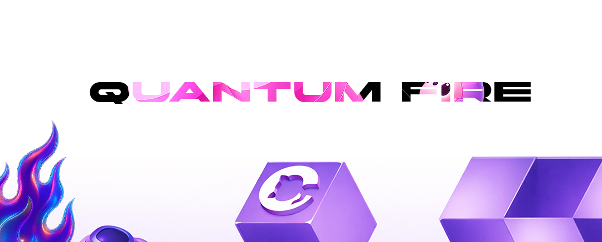

#Eyecode University #Task
<h2>👥 Студенты </h2>
<ul>
  <li>Student ID: #FD-240501-001 — Тимофей Столяров </li>
  <li>Student ID: #FD-240501-002 — Вадим Болотников </li>
  <li>Student ID: #FD-240501-003 — Александр Ефремов </li>
  <li>Student ID: #FD-240501-004 — Платон Захаров </li>
  <li>Student ID: #FD-240501-007 — Михаил Третьяк </li>
  <li>Student ID: #FD-240501-008 — Чингиз Приймак </li>
</ul> 
# 🧠 Задание: Многоязычный лендинг «Museum of the Future, Dubai» (Next.js + React + i18n)

**Цель:**  
Создать одностраничный промо‑сайт про **Museum of the Future** (Дубай, ОАЭ) на **Next.js + React** с поддержкой 5 языков: **английский, русский, японский, китайский, турецкий**.[web:41][web:42][web:45][web:51][web:54][web:55][web:57]

---

## ✅ Требования к функционалу

###  Технологический стек

- **Next.js** (App Router или Pages Router — на выбор).
- **React**.
- Библиотека для интернационализации (**i18n**) на выбор, например:
  - `next-i18next`
  - `next-intl`
  - `react-i18next` и настройка под Next.js[web:51][web:54][web:55][web:57][web:58]

---

###  Структура страницы (лендинг)

Одна основная страница (например, `/`), по сути лендинг музея:

Обязательные блоки:

1. **Hero‑блок**
   - Название: *Museum of the Future, Dubai*.
   - Краткий подзаголовок: что это за музей, про будущее, технологии, инновации.[web:41][web:42][web:45][web:48]

2. **Блок «Почему стоит посетить?»**
   - 3–5 пунктов/причин:  
     примеры — иммерсивные экспозиции, футуристический дизайн, технологии, опыт для детей и взрослых.[web:41][web:42][web:45][web:44][web:48]

3. **Блок с фактами**
   - Краткие факты: город, страна, концепция (музей будущего, наука, технологии), год открытия (кратко).[web:42][web:45][web:48]

4. **Блок с базовой визитной информацией**
   - Локация: Дубай, ОАЭ.[web:41][web:42][web:45][web:49]
   - Краткое описание формата посещения (общими словами, без точных цен/расписаний).

Тексты студенты формулируют сами, опираясь на общую идею музея будущего.

---

###  Мультиязычность (i18n)

Поддерживаемые языки:

- **EN** — английский  
- **RU** — русский  
- **JA** — японский  
- **ZH** — китайский  
- **TR** — турецкий

#### Обязательные требования:

- На странице есть переключатель языка:
  - это могут быть кнопки (`EN | RU | JA 

  
 
📤 Сдача
 
Отправить ссылку на репозиторий GitHub или отправить лично в архиве ZIP.
 
⏳ Дедлайн: 14 дней 
 <a href="https://www.eyecodeuniversity.ru">www.eyecodeuniversity.ru</a> 

  
